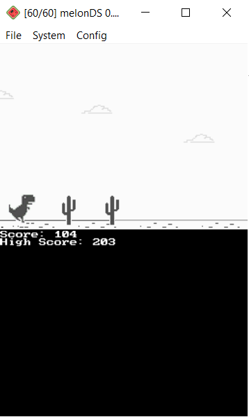
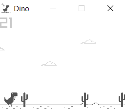
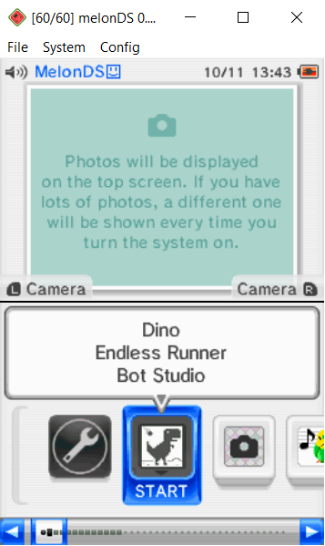

<!-- PROJECT LOGO -->
<h1 align="center">
   
  
   
  <b>Dino</b>
   
  <b>Dino, a NDS homebrew endless runner, written in C.</b>
   

</h1>

       Dino is a recreation of Google's T-Rex Runner <strong>targeting the Nintendo DS, and PC</strong>. You know this game, the one when you lose your internet connection, and then this little dinosaur pops up. What a delight.
   This project came to be when I was coming up with ideas of what my first C project should be. Since I haven't done <strong>C</strong> before this, I figured this was the best way to learn C: making <strong>homebrew</strong> for the NDS! The DS has a special place in my heart, so why not decated my first C project to the DS, also taking adavantage of the fact that C is low level language compared to languages such as C#, Java, etc, so it can pretty much target any platform. This isn't the first T-rex runner on the NDS, but hey it's all for <strong>fun</strong>! :)  

<!-- ABOUT THE PROJECT -->

## Getting Started
As may have notice, along NDS version, there is a Windows version, as I actually made the game targeting PC first with Raylib, then I was able to port it to NDS using DevKitPro, libnds, and NightFox's Lib. I'll go over both for getting started.

### Download

#### NDS (Works on all NDS and 3DS models, also Emulators)
There is many ways to about this, also having to take in consideration if your going to play on real hardware or a emulator. I will just mention the possible ways to go about this.

1. Download the .nds ROM file [here](https://github.com/BotRandomness/DinoDS) or from the releases.
- For real hardware, simple place the .nds ROM on to your flashcart. This should work all NDS and 3DS models as longer the flashcart is setup properly beforehand.
  - You can also use Twighlight Menu on the DSi and the 3DS models. Do note this options require a homebrewed DSi and 3DS.  
- For emulators, pretty much any NDS emulators should work including MelonDS, Desmume, Drastic, etc. Make sure the DLDI option is checked if not by default.
  - Example: In MelonDS, go to Config --> Emu Settings --> DLDI --> then check the box "Enable DLDI(for homebrew)"

#### PC (Windows)
1. Download the Zip file [here](https://github.com/BotRandomness/DinoDS) or from the releases tab under PC Windows.
2. Extract the zip file at your desire location
3. Open the `Dino.exe`, the game is just a single file, no installation, it just opens up ready to be played.

### Controls
#### NDS
- To Jump, press (A) or Tap the screen
- To jump reapeatly, hold (A) or tap and hold the screen
#### PC
- To Jump, press [UP] key or press [SPACE]
- To jump reapeatly, hold [UP] key or hold [SPACE]
#### Note
- The catus genaration is not perfect, so sometimes you can have a row of catus that seems impossible to jump over, but worry not! I created "forgiveness hitbox" where only catus that hit you head on or directly below will cause a gameover. If it hit's your tail, you should be good. Take advantage of that, also the reapeat jump ;)

## Screenshots
<table>
    <tr>
        <th>NDS</th>
        <th>PC</th>
    </tr>
    <tr>
        <td width="25%"></td>
        <td width="25%"> </td>
    </tr>
  <tr>
        <td></td>
        <td></td>
    </tr>
  <tr>
        <td></td>
        <td></td>
    </tr>
  <tr>
        <td></td>
        <td></td>
    </tr>
  <tr>
        <td></td>
        <td></td>
    </tr>
</table>

<table>
    <tr>
        <th>DS/DS lite</th>
        <th>DSi</th>
    </tr>
    <tr>
        <td></td>
        <td></td>
    </tr>
</table>

## Compile

Want to tinker around, modify, make your own, or contribute? Here's how you can get started with the code and compile. I'll split this to two sections, one for the NDS version and one for the PC version.

#### NDS
The NDS version uses a open-source toolchain known as DevKitPro. DevKitPro comes with many compilers and libraries to start homebrew development on many consoles! The specific library were using is libnds which should come with DevKitPro, and another library known as NightFox's Lib which helps with graphics. I was already included NightFox's Lib in this repository.

1. Download DevKitPro: https://devkitpro.org/, please do look over their getting started.
2. After DevKitPro is set up, download this repository through zip, or git, then open up your terminal, pointing inside the project directory.
3. Run `make` in the terminal, and `DinoDS.nds` will be made!

#### PC
The PC version uses raylib. RayLib provides a simple way to use graphics with minimal overhead with the focus on portability and is also very modular, having the core library in a single header file. Raylib is made with C but can also be used with C++. Due to raylib being design in C, it has many binding for languages such as Java, C#, python, and much more. In our case, were using the standard C raylib.

1. Download raylib: https://www.raylib.com/
2. Once raylib is install to your system, depending what IDE/text editor your using, raylib provides templates and excute files for these setup to compile the game.
   - These templates and excute files can be found `raylib\projects\[NAMES OF IDES/TEXT EDITORS]`
   - For example using Windows, raylib already comes with NotePad++ pre-configured, just open the `main.c` in NotePad++ and press [F6], then "Ok", and it will compile!

### Program Architechture
The first question you may be asking is if I wanted to make a NDS homebrew, why did you make a PC version? To that I say just a good base to work off of. Since I used standard C along with raylib, which as said before has very low over head, it made it seems start with a base before moving onto the NDS version. Also it was just really fun to make 2 version of the same game of differnent platform. Being able to "port" was just fun to do! :)

One thing to note is since the PC version was made first, both PC version and NDS version do look slightly different and may not match to this genaral outline I am going to go over. I did write the NDS version of the code by using PC version as a base, so you can see where I comment out the raylib functions with libnds and NightFox's Lib functions.

Typically in game development, use classes, to represent objects. Objects can be the players to coins, to even the level itself. However with C, we don't way to make classes like say in C++. However, this does not stop us to still create structure for a game. Dino is fairly a simple game. With that, this is how the basic program is layed out!  

Both the for the NDS and PC versions, they contain a single `main.c` that contains the entire game. Again to mention, since Dino is a simple endless runnner, the game code essentially revolves around the player, in our case, Dino the T-Rex. In the main functions contains variables for all attributes for the player, catuses, clouds, ground, etc. These attributes includes like the players x and y positions: `posX` and `posY`, `gravity`, catus x and y positions, etc. In the NDS version of the code, this is where we load the graphics and pallets into RAM and VRAM, along with defining the sprites and backgrounds. 

Outside the main function, I have declear a few functions relating to obstacle genration, cloud genration, ground genration, and collision detection. These functions get passed in revelent varibles I defined in the main function. Back in the main function, after all the varible defining, there a while loop, which is the "main game loop". The main game loop run once per frame. The game loop itself is then split into 2, a `Update` part, and a `Draw` part. The Update part is where we can update the variables, think about the stuff we can't see. While the Draw part is all where all relavent rendering code goes. Overall in the main function is where I handle all the player code, with the other functions mention before being call and used that is revelent to the player code.

If you are interested in the NDS and or making NDS homebrew, these are good reads:
- Rodrigo Copetti's Nintendo DS Architechture Analysis: https://www.copetti.org/writings/consoles/nintendo-ds/
- Foxi4's DS Programming 101: https://gbatemp.net/threads/ds-programming-for-newbies.322106/
Also check out NightFox's Lib GitHub repository: https://github.com/knightfox75/nds_nflib

Looking over the code, the program is quite simple, don't worry!

## Upcoming Features

- [ ] 2 Player Co-Op
  - Top Screen for Player 1, and Bottom Screen for Player 2
- [ ] Saving. Save high score for both NDS and PC version.  
- Post any feature request in the Issues tab!

## Known issues

- Catus genaration can be tweaked
- If you find any other issues/bugs, post about it on the issues tab
  - Also provide what version your using (NDS or PC, operating system, platform, console model, emulator used), and how to reproduce it

## Contributing

This project is open-source under the MIT License, meaning your free to do what ever you want with it. This project is freely available for anyone to contribute, NDS lover, homebrew developers, or someone who is new to it all.

If you plan on contributing, a good place to start is to look at upcoming wanted features, and known issues. If you find a new bug, or have feature ideas of your own, posted first to the Issues tab before hand. You can even fork it and make it your own!  

To get started on contributing:

1. Fork or Clone the Project
2. Once you have your own repository (it can be a public repository) to work in, you can get started on what you want to do!
3. Make sure you git Add and git Commit your Changes to your repository
4. Then git push to your repository
5. Open a Pull Request in this repositroy, where your changes will be look at to be approved
6. Once it's approved, it will be in a development branch, soon to be merge to the main branch

<!-- LICENSE -->

## License

Distributed under the MIT License. See `LICENSE.txt` for more information.
